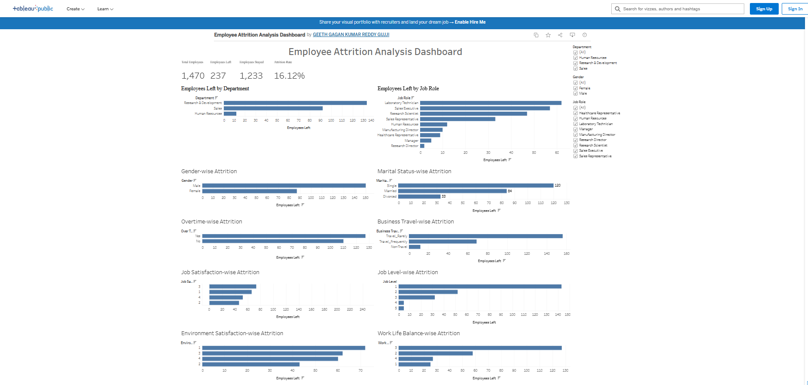

# Employee Attrition Analysis

## Project Overview

This project analyzes employee attrition using the IBM HR Employee Attrition dataset. The objective is to identify the key factors contributing to employee turnover through data cleaning, exploratory data analysis (EDA), KPI analysis, and an interactive Tableau dashboard. The insights obtained can help organizations improve employee retention and support HR decision-making.

---

## Objectives

- Understand employee attrition patterns.
- Perform data cleaning and preprocessing.
- Conduct exploratory data analysis.
- Analyze key business KPIs.
- Develop an interactive Tableau dashboard.
- Provide business insights and recommendations.

---

## Tools and Technologies

- Python
- Pandas
- NumPy
- Matplotlib
- Seaborn
- Jupyter Notebook
- Tableau Public
- Git & GitHub

---

## Project Structure

```
EMPLOYEE-ATTRITION-ANALYSIS-PROJECT/
│
├── Data/
│   ├── Raw/
│   └── Processed/
│
├── Notebooks/
│   ├── 01_Data_Cleaning.ipynb
│   ├── 02_Exploratory_Data_Analysis.ipynb
│   └── 03_KPI_Analysis.ipynb
│
├── Dashboard/
│   ├── Employee_Attrition_Dashboard.twbx
│   └── Dashboard_Preview.png
│
├── Reports/
│   ├── 01_Dataset_Understanding.md
│   ├── 02_Data_Cleaning_Report.md
│   ├── 03_EDA_Report.md
│   ├── 04_Dashboard_Report.md
│   ├── 05_Business_Insights.md
│   └── 06_Business_Recommendations.md
│
├── README.md
├── LICENSE
└── requirements.txt
```
---

## Dashboard Preview



---

## Tableau Dashboard

**Live Dashboard:**

https://public.tableau.com/app/profile/geeth.gagan.kumar.reddy.gujji/viz/EmployeeAttritionAnalysisDashboard_17838850554550/Dashboard1?publish=yes

The dashboard allows users to interactively explore employee attrition by department, job role, overtime, work-life balance, job satisfaction, and other HR-related factors using dynamic filters.

---

## Key Findings

- Sales department recorded the highest attrition rate (20.63%) among all departments.
- Sales Representatives showed the highest attrition rate (39.76%) among all job roles.
- Employees working overtime experienced nearly three times higher attrition than employees who did not work overtime.
- Employees with lower monthly income and fewer years of experience were more likely to leave the organization.
- Lower work-life balance, job satisfaction, and environment satisfaction were associated with higher employee attrition.

---

## Future Scope

- Build a machine learning model to predict employee attrition.
- Develop a real-time HR analytics dashboard.
- Include additional HR performance metrics for deeper analysis.

---

## Author

Geeth Gagan Kumar Reddy Gujji

B.Tech CSE (Artificial Intelligence)

Amrita Vishwa Vidyapeetham, Chennai